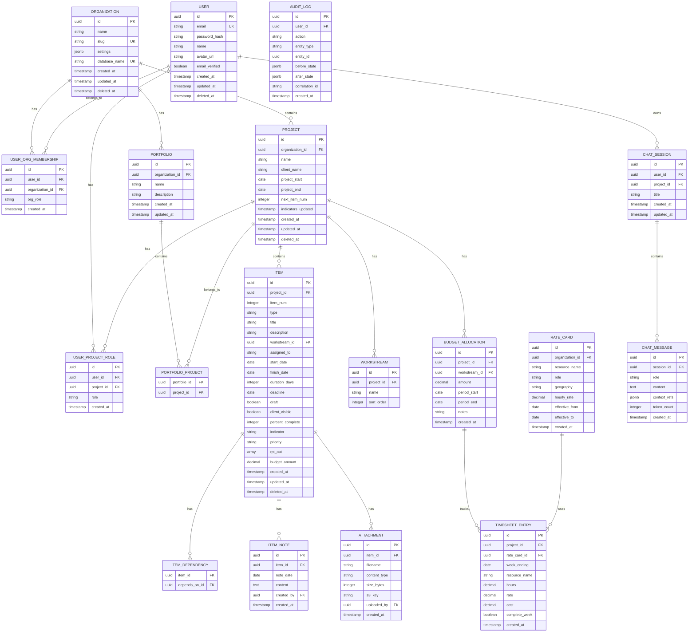

# braidMgr Logical Data Model

*Last updated: 2024-12-24*

This document defines the logical data model for braidMgr v2 with multi-tenant, multi-user support.

**Key Concepts**:
- 18 entities across 5 domains
- Database-per-organization multi-tenancy
- PostgreSQL with full-text search
- Soft deletes for audit trail

---

## Child Documents

| Document | Entities | Description |
|----------|----------|-------------|
| [core-entities.md](data-model/core-entities.md) | Organization, User, User_Org_Membership, Project, Portfolio, Portfolio_Project | Multi-tenant foundation |
| [item-entities.md](data-model/item-entities.md) | Item, Workstream, Item_Note, Item_Dependency, Attachment | RAID log items |
| [budget-entities.md](data-model/budget-entities.md) | Rate_Card, Budget_Allocation, Timesheet_Entry | Financial tracking |
| [access-chat-entities.md](data-model/access-chat-entities.md) | User_Project_Role, Chat_Session, Chat_Message, Audit_Log | RBAC and AI chat |
| [enums-architecture.md](data-model/enums-architecture.md) | Enum definitions, DB architecture, v1 migration | Technical details |

---

## Entity Summary

| Entity | Domain | Description |
|--------|--------|-------------|
| Organization | Core | Tenant with isolated database |
| User | Core | Application user (central DB) |
| User_Org_Membership | Core | User-org relationship with role |
| Project | Core | RAID log project container |
| Portfolio | Core | Flexible project grouping |
| Portfolio_Project | Core | M:N portfolio-project junction |
| Item | Items | RAID log entry |
| Workstream | Items | Project work area |
| Item_Note | Items | Timestamped item notes |
| Item_Dependency | Items | Item predecessor links |
| Attachment | Items | S3-stored file reference |
| Rate_Card | Budget | Resource billing rates |
| Budget_Allocation | Budget | Planned budget amounts |
| Timesheet_Entry | Budget | Actual time/cost tracking |
| User_Project_Role | Access | Project-level RBAC |
| Chat_Session | Chat | AI conversation container |
| Chat_Message | Chat | Individual chat message |
| Audit_Log | System | Immutable change log |

---

## Entity Relationship Diagram



---

## Quick Reference

### Enum Types

| Enum | Values | Used By |
|------|--------|---------|
| item_type_enum | Budget, Risk, Action Item, Issue, Decision, Deliverable, Plan Item | Item.type |
| indicator_enum | Beyond Deadline!!!, Late Finish!!, Late Start!!, Trending Late!, Finishing Soon!, Starting Soon!, In Progress, Not Started, Completed Recently, Completed | Item.indicator |
| org_role_enum | owner, admin, member | User_Org_Membership.org_role |
| project_role_enum | admin, project_manager, team_member, viewer | User_Project_Role.role |
| chat_role_enum | user, assistant, system | Chat_Message.role |

### Database Layout

```
Central Database (braidmgr_central)
├── users
├── organizations
├── user_org_memberships
└── audit_log (central)

Organization Database (braidmgr_org_{slug})
├── projects, portfolios, portfolio_projects
├── items, workstreams, item_notes, item_dependencies, attachments
├── user_project_roles
├── rate_cards, budget_allocations, timesheet_entries
├── chat_sessions, chat_messages
└── audit_log (per-org)
```
