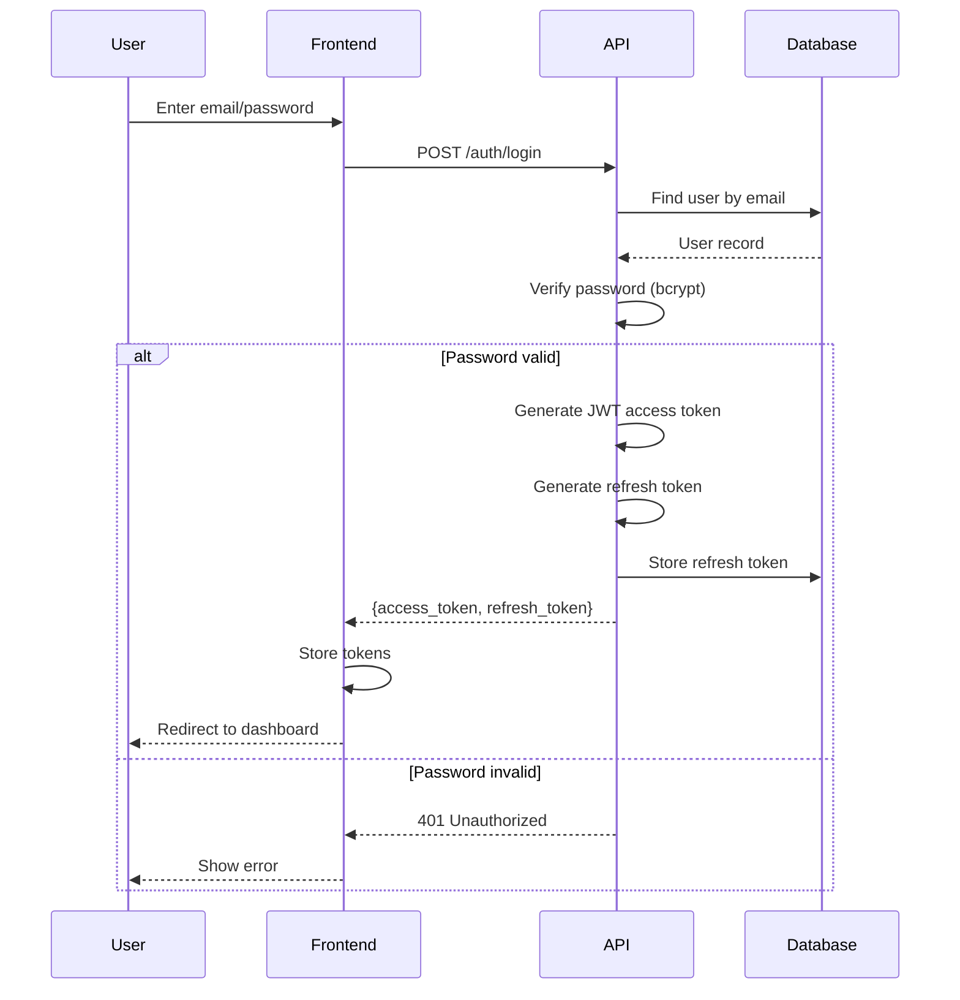
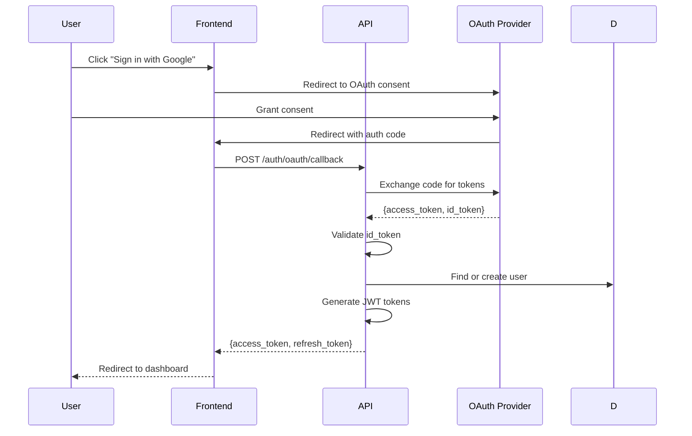
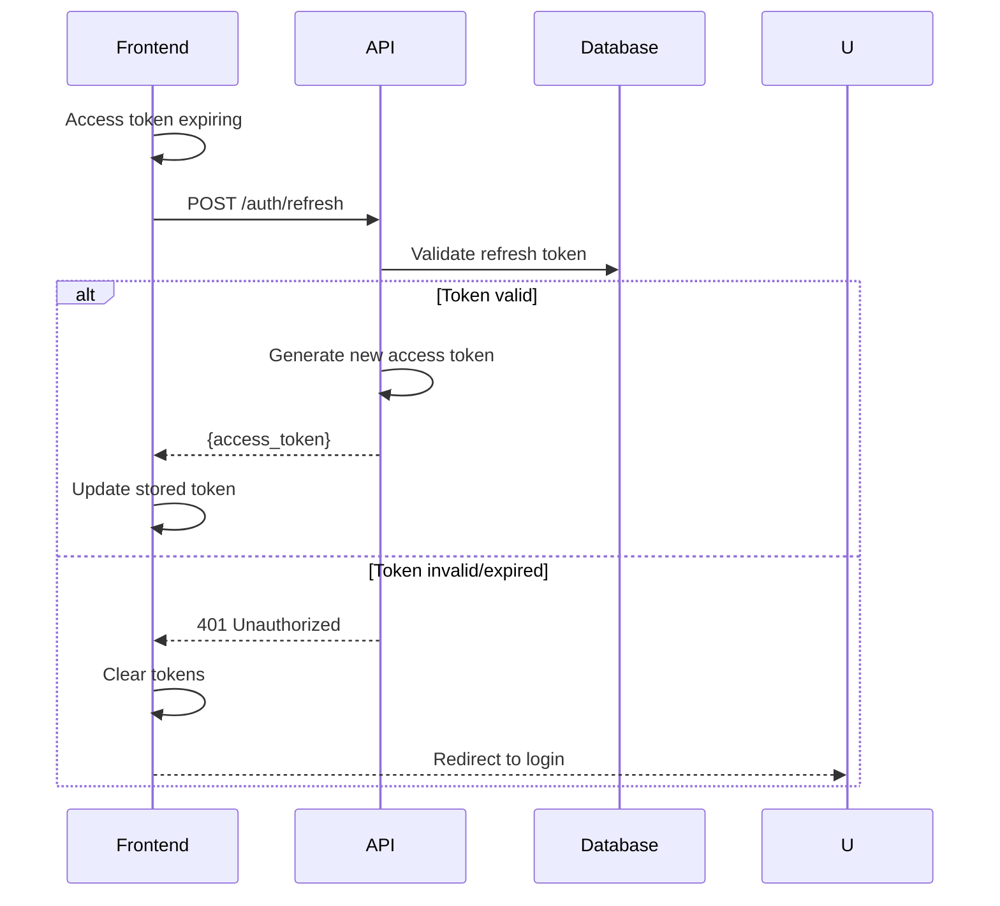

# Authentication Flows

*Parent: [PROCESS_FLOWS.md](../PROCESS_FLOWS.md)*

Login, OAuth, and token refresh flows.

**Key Concepts**:
- JWT access tokens (15 min) + refresh tokens (7 days)
- OAuth support for Google and Microsoft
- Refresh before access token expiry
- Redirect to login on refresh failure

---

## Email/Password Login



---

## OAuth Flow



**OAuth Providers**:
- Google: scopes = email, profile
- Microsoft: scopes = User.Read

---

## Token Refresh



---

## Token Storage

| Token | Storage | Why |
|-------|---------|-----|
| Access token | Memory | Short-lived, XSS vulnerable but expires fast |
| Refresh token | httpOnly cookie | Not accessible to JavaScript |

---

## Frontend Token Management

```typescript
// Proactive refresh before expiry
const REFRESH_MARGIN_MS = 60 * 1000; // 1 minute before expiry

function scheduleTokenRefresh(expiresAt: number) {
    const refreshAt = expiresAt - REFRESH_MARGIN_MS;
    const delay = refreshAt - Date.now();

    if (delay > 0) {
        setTimeout(async () => {
            try {
                await refreshAccessToken();
            } catch {
                // Refresh failed, redirect to login
                window.location.href = '/login';
            }
        }, delay);
    }
}
```
