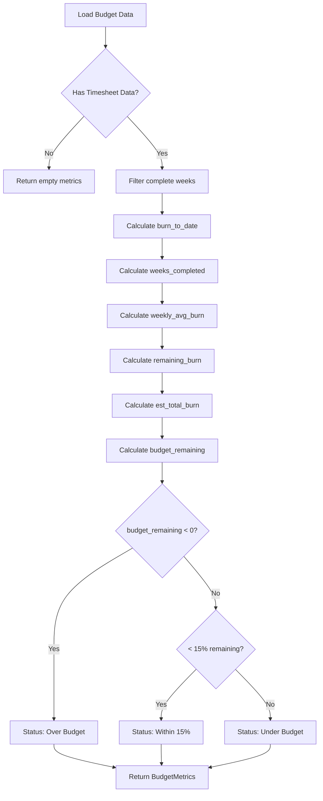

# Budget Calculation Flows

*Parent: [PROCESS_FLOWS.md](../PROCESS_FLOWS.md)*

Budget metrics and burn rate calculations.

**Key Concepts**:
- Only complete weeks included in averages
- Weekly burn rate predicts future spend
- Status based on remaining budget percentage
- Cumulative tracking for burn charts

---

## Calculate Metrics Flow



---

## Weekly Burn Calculation

```python
from collections import defaultdict
from dataclasses import dataclass
from datetime import date
from decimal import Decimal

@dataclass
class WeeklyBurn:
    week_ending: date
    cost: Decimal
    cumulative: Decimal


def calculate_weekly_burn(timesheet_entries: list) -> list[WeeklyBurn]:
    """Calculate weekly burn with cumulative."""
    by_week = defaultdict(Decimal)

    for entry in timesheet_entries:
        if entry.complete_week:  # Only complete weeks
            by_week[entry.week_ending] += entry.cost

    weekly_burn = []
    cumulative = Decimal('0')

    for week in sorted(by_week.keys()):
        cost = round(by_week[week], 2)
        cumulative = round(cumulative + cost, 2)
        weekly_burn.append(WeeklyBurn(
            week_ending=week,
            cost=cost,
            cumulative=cumulative
        ))

    return weekly_burn
```

---

## Budget Metrics Calculation

```python
@dataclass
class BudgetMetrics:
    total_budget: Decimal
    burn_to_date: Decimal
    weeks_completed: int
    weekly_avg_burn: Decimal
    remaining_budget: Decimal
    weeks_remaining: int
    est_total_burn: Decimal
    status: str  # "under", "within_15", "over"


def calculate_budget_metrics(
    budget_total: Decimal,
    timesheet_entries: list
) -> BudgetMetrics:
    """Calculate comprehensive budget metrics."""
    weekly_burn = calculate_weekly_burn(timesheet_entries)

    if not weekly_burn:
        return BudgetMetrics(
            total_budget=budget_total,
            burn_to_date=Decimal('0'),
            weeks_completed=0,
            weekly_avg_burn=Decimal('0'),
            remaining_budget=budget_total,
            weeks_remaining=0,
            est_total_burn=Decimal('0'),
            status="under"
        )

    burn_to_date = weekly_burn[-1].cumulative
    weeks_completed = len(weekly_burn)
    weekly_avg_burn = burn_to_date / weeks_completed
    remaining_budget = budget_total - burn_to_date

    # Estimate remaining weeks at current burn rate
    if weekly_avg_burn > 0:
        weeks_remaining = int(remaining_budget / weekly_avg_burn)
        est_total_burn = burn_to_date + (weeks_remaining * weekly_avg_burn)
    else:
        weeks_remaining = 0
        est_total_burn = burn_to_date

    # Determine status
    if remaining_budget < 0:
        status = "over"
    elif remaining_budget / budget_total < Decimal('0.15'):
        status = "within_15"
    else:
        status = "under"

    return BudgetMetrics(
        total_budget=budget_total,
        burn_to_date=burn_to_date,
        weeks_completed=weeks_completed,
        weekly_avg_burn=round(weekly_avg_burn, 2),
        remaining_budget=remaining_budget,
        weeks_remaining=weeks_remaining,
        est_total_burn=round(est_total_burn, 2),
        status=status
    )
```

---

## API Response Structure

```json
{
    "data": {
        "total_budget": 100000.00,
        "burn_to_date": 45000.00,
        "weeks_completed": 10,
        "weekly_avg_burn": 4500.00,
        "remaining_budget": 55000.00,
        "weeks_remaining": 12,
        "est_total_burn": 99000.00,
        "status": "under",
        "weekly_burn": [
            {"week_ending": "2024-12-06", "cost": 4200.00, "cumulative": 4200.00},
            {"week_ending": "2024-12-13", "cost": 4800.00, "cumulative": 9000.00}
        ]
    }
}
```
