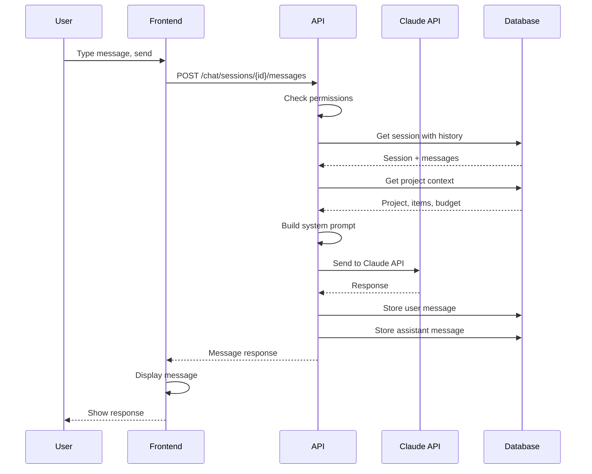
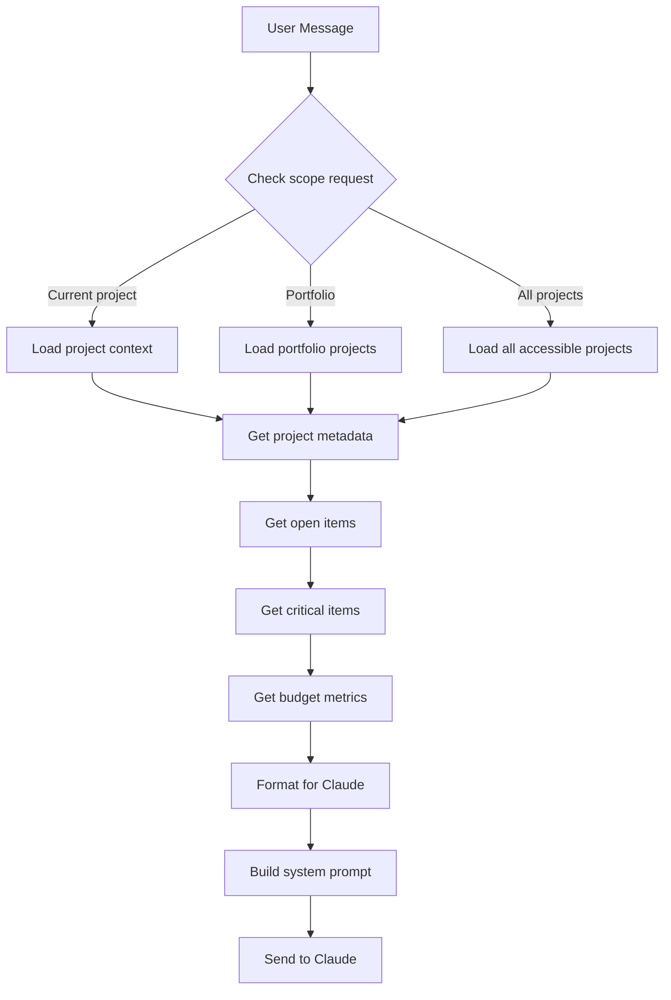

# AI Chat Flows

*Parent: [PROCESS_FLOWS.md](../PROCESS_FLOWS.md)*

Claude integration for natural language queries.

**Key Concepts**:
- Context built from project data respecting RBAC
- Default scope is current project
- Users can expand scope by asking
- Messages and context refs stored for history

---

## Send Message Flow



---

## Context Building Flow



---

## Scope Detection

```python
def detect_scope_expansion(message: str) -> str:
    """Detect if user wants cross-project query."""
    message_lower = message.lower()

    portfolio_patterns = ["portfolio", "program"]
    all_patterns = ["across all", "all projects", "all my projects",
                    "every project", "compare projects"]

    if any(p in message_lower for p in all_patterns):
        return "all"
    if any(p in message_lower for p in portfolio_patterns):
        return "portfolio"
    return "current"
```

---

## RBAC Enforcement

```python
async def get_chat_context(
    user_id: UUID,
    project_id: UUID,
    scope: str
) -> ChatContext:
    """Get context respecting RBAC."""

    if scope == "current":
        # Verify access to project
        if not await has_project_access(user_id, project_id):
            raise AuthorizationError("No access to project")
        return await build_project_context(project_id)

    elif scope == "portfolio":
        # Get portfolio and verify access to all projects
        portfolio = await get_portfolio_for_project(project_id)
        projects = await get_accessible_portfolio_projects(user_id, portfolio.id)
        return await build_portfolio_context(projects)

    elif scope == "all":
        # Get all user's accessible projects
        projects = await get_user_accessible_projects(user_id)
        return await build_multi_project_context(projects)
```

---

## System Prompt Template

```python
SYSTEM_PROMPT = """You are an AI assistant for braidMgr, a project management application.
You have access to the following project data:

PROJECT: {project_name}
CLIENT: {client_name}
DATES: {start_date} to {end_date}

{context_summary}

Guidelines:
- Be concise and specific
- Reference item numbers (e.g., "Item #42") when discussing items
- If asked about data outside your context, explain your scope
- Focus on actionable insights
"""
```

---

## Message Storage

```python
async def store_message(
    session_id: UUID,
    role: str,
    content: str,
    context_refs: dict = None,
    token_count: int = None
) -> ChatMessage:
    """Store chat message with metadata."""
    return await aurora.execute_returning(
        pool,
        """
        INSERT INTO chat_messages
        (id, session_id, role, content, context_refs, token_count, created_at)
        VALUES ($1, $2, $3, $4, $5, $6, NOW())
        RETURNING *
        """,
        uuid4(), session_id, role, content,
        json.dumps(context_refs) if context_refs else None,
        token_count
    )
```
