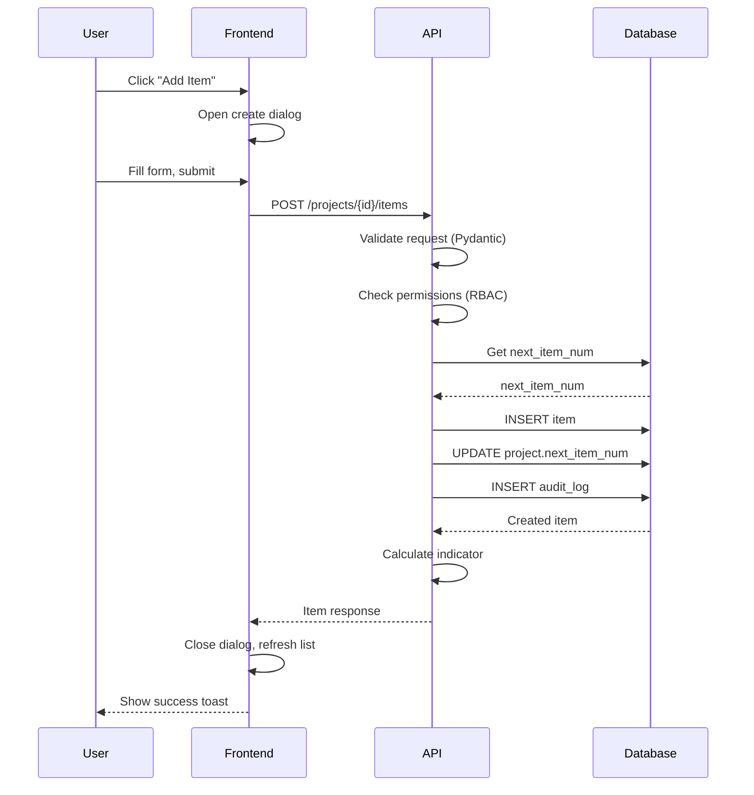
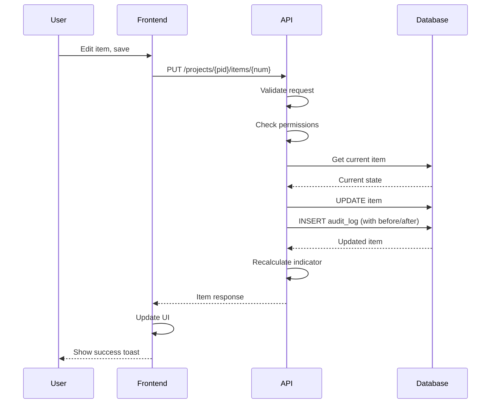
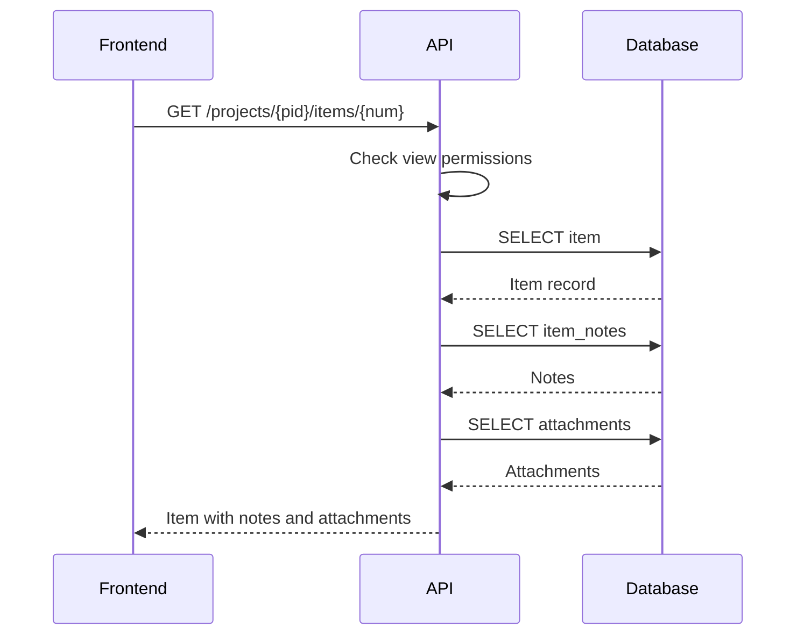
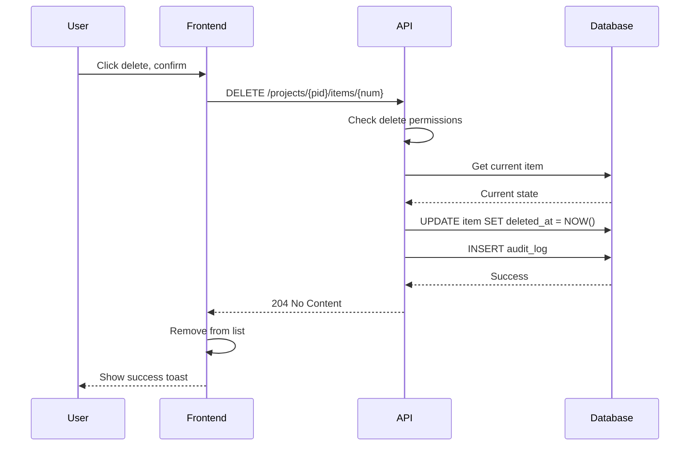

# Item CRUD Flows

*Parent: [PROCESS_FLOWS.md](../PROCESS_FLOWS.md)*

Create, read, update, delete flows for RAID items.

**Key Concepts**:
- All operations check RBAC permissions first
- Audit log entry for all data changes
- Indicator recalculated after create/update
- Item numbers auto-increment per project

---

## Create Item



---

## Update Item



---

## Read Item



---

## Delete Item



---

## Item Number Assignment

```python
async def create_item(project_id: UUID, data: ItemCreate) -> Item:
    """Create item with auto-assigned number."""
    async with aurora.transaction(pool) as conn:
        # Get and increment item number atomically
        project = await conn.fetchrow("""
            UPDATE projects
            SET next_item_num = next_item_num + 1
            WHERE id = $1
            RETURNING next_item_num - 1 as item_num
        """, project_id)

        # Create item with assigned number
        item = await conn.fetchrow("""
            INSERT INTO items (id, project_id, item_num, type, title, ...)
            VALUES ($1, $2, $3, $4, $5, ...)
            RETURNING *
        """, uuid4(), project_id, project['item_num'], data.type, data.title, ...)

    return Item.from_row(item)
```

---

## Audit Log Entry

```python
async def log_change(
    conn,
    user_id: UUID,
    action: str,
    entity_type: str,
    entity_id: UUID,
    before_state: dict = None,
    after_state: dict = None
):
    """Record audit log entry."""
    await conn.execute("""
        INSERT INTO audit_log
        (id, user_id, action, entity_type, entity_id, before_state, after_state, correlation_id, created_at)
        VALUES ($1, $2, $3, $4, $5, $6, $7, $8, NOW())
    """,
        uuid4(),
        user_id,
        action,
        entity_type,
        entity_id,
        json.dumps(before_state) if before_state else None,
        json.dumps(after_state) if after_state else None,
        correlation_id_var.get()
    )
```
