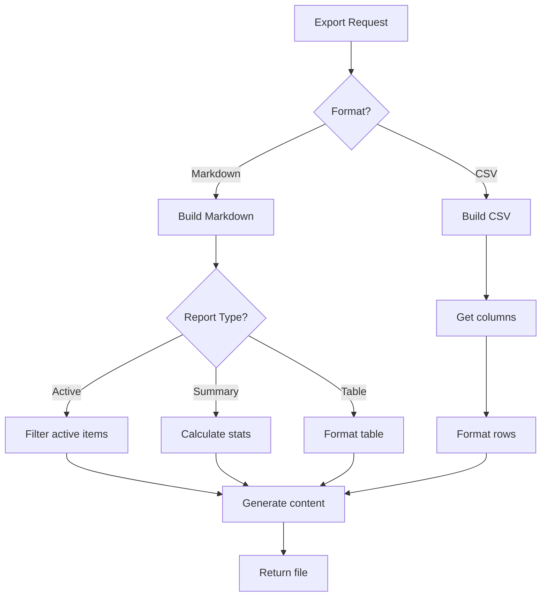

# Export Flows

*Parent: [PROCESS_FLOWS.md](../PROCESS_FLOWS.md)*

Export generation for Markdown and CSV formats.

**Key Concepts**:
- Exports respect current filter state
- Markdown for human-readable reports
- CSV for Excel/data analysis
- Download as file

---

## Generate Export Flow



---

## Markdown Export

```python
def export_active_items_markdown(items: list[Item]) -> str:
    """Export active items as Markdown."""
    lines = [
        "# Active Items Report",
        f"\n*Generated: {datetime.now().strftime('%Y-%m-%d %H:%M')}*\n",
    ]

    # Group by severity
    critical = [i for i in items if 'Late' in (i.indicator or '') or 'Deadline' in (i.indicator or '')]
    warning = [i for i in items if i.indicator == 'Trending Late!']
    active = [i for i in items if i.indicator == 'In Progress']
    upcoming = [i for i in items if i.indicator in ('Starting Soon!', 'Finishing Soon!')]

    if critical:
        lines.append("## Critical\n")
        for item in critical:
            lines.append(f"- **#{item.item_num}**: {item.title} ({item.indicator})")
        lines.append("")

    if warning:
        lines.append("## Warning\n")
        for item in warning:
            lines.append(f"- #{item.item_num}: {item.title}")
        lines.append("")

    if active:
        lines.append("## In Progress\n")
        for item in active:
            lines.append(f"- #{item.item_num}: {item.title} ({item.percent_complete}%)")
        lines.append("")

    if upcoming:
        lines.append("## Upcoming\n")
        for item in upcoming:
            lines.append(f"- #{item.item_num}: {item.title} ({item.indicator})")

    return "\n".join(lines)
```

---

## CSV Export

```python
import csv
import io

def export_items_csv(items: list[Item]) -> str:
    """Export items as CSV."""
    output = io.StringIO()
    writer = csv.writer(output)

    # Header row
    writer.writerow([
        'Item #', 'Type', 'Title', 'Status', 'Assigned To',
        'Start Date', 'Finish Date', 'Deadline',
        '% Complete', 'Workstream'
    ])

    # Data rows
    for item in items:
        writer.writerow([
            item.item_num,
            item.type,
            item.title,
            item.indicator or '',
            item.assigned_to or '',
            item.start_date.isoformat() if item.start_date else '',
            item.finish_date.isoformat() if item.finish_date else '',
            item.deadline.isoformat() if item.deadline else '',
            item.percent_complete,
            item.workstream_name or ''
        ])

    return output.getvalue()
```

---

## Filtered Export

```python
async def export_filtered(
    project_id: UUID,
    filters: ExportFilters,
    format: str
) -> ExportResult:
    """Export with applied filters."""
    # Build query with filters
    query = "SELECT * FROM items WHERE project_id = $1 AND deleted_at IS NULL"
    params = [project_id]

    if filters.type:
        query += f" AND type = ${len(params) + 1}"
        params.append(filters.type)

    if filters.indicator:
        query += f" AND indicator = ${len(params) + 1}"
        params.append(filters.indicator)

    if filters.assignee:
        query += f" AND assigned_to = ${len(params) + 1}"
        params.append(filters.assignee)

    if filters.open_only:
        query += " AND indicator != 'Completed'"

    if filters.critical_only:
        query += " AND indicator IN ('Beyond Deadline!!!', 'Late Finish!!', 'Late Start!!')"

    items = await aurora.execute_query(pool, query, *params)

    # Generate export
    if format == "markdown":
        content = export_active_items_markdown(items)
        filename = f"items-{date.today().isoformat()}.md"
    else:
        content = export_items_csv(items)
        filename = f"items-{date.today().isoformat()}.csv"

    return ExportResult(content=content, filename=filename)
```

---

## API Endpoint

```python
from fastapi.responses import StreamingResponse

@router.get("/projects/{project_id}/export")
async def export_items(
    project_id: UUID,
    format: str = Query("csv", enum=["csv", "markdown"]),
    type: Optional[str] = None,
    indicator: Optional[str] = None,
    assignee: Optional[str] = None,
    open_only: bool = False,
    critical_only: bool = False,
    pool: asyncpg.Pool = Depends(get_org_pool)
):
    """Export items with filters."""
    filters = ExportFilters(
        type=type,
        indicator=indicator,
        assignee=assignee,
        open_only=open_only,
        critical_only=critical_only
    )

    result = await export_filtered(project_id, filters, format)

    media_type = "text/csv" if format == "csv" else "text/markdown"
    return StreamingResponse(
        iter([result.content]),
        media_type=media_type,
        headers={"Content-Disposition": f"attachment; filename={result.filename}"}
    )
```
