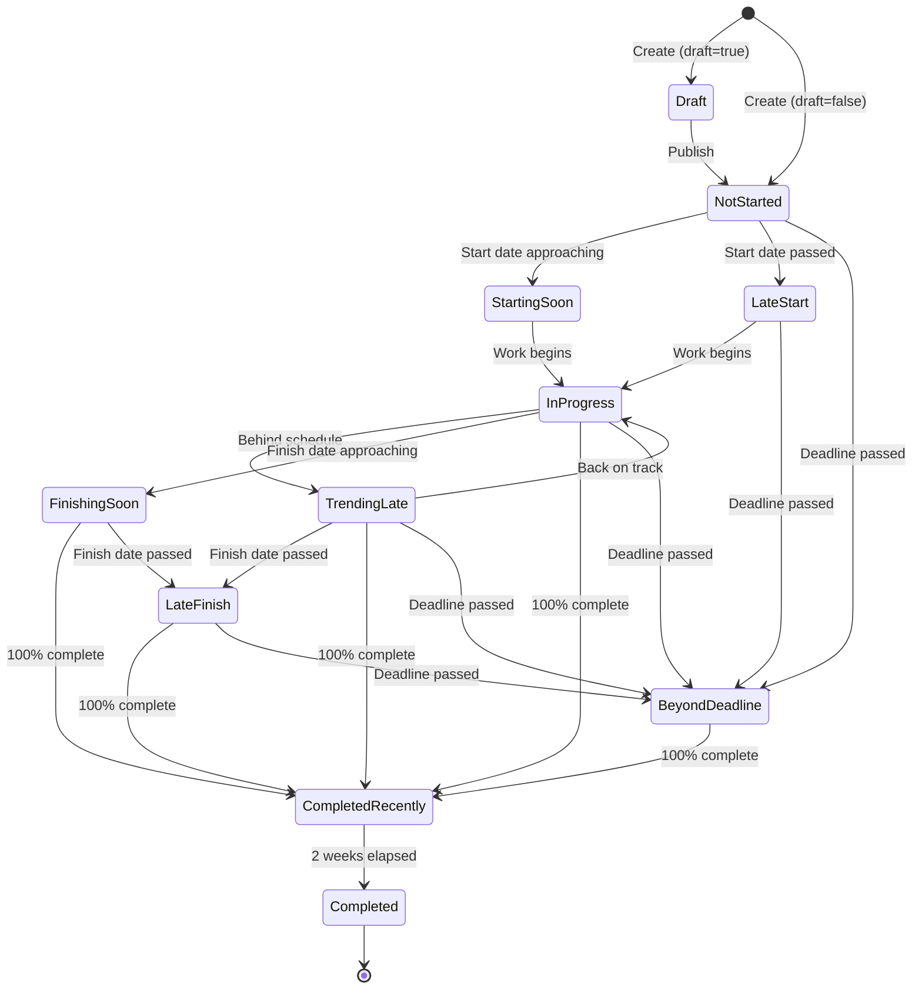

# Item Lifecycle Flow

*Parent: [PROCESS_FLOWS.md](../PROCESS_FLOWS.md)*

State machine and indicator calculation for RAID items.

**Key Concepts**:
- Items transition through states based on dates and completion
- Indicators calculated in precedence order (most critical first)
- Draft items have no indicator
- "Recently" states last 2 weeks after completion

---

## State Machine



---

## State Definitions

| State | Indicator | Severity | Trigger |
|-------|-----------|----------|---------|
| Draft | (none) | - | draft=true |
| Not Started | Not Started | upcoming | 0%, has dates |
| Starting Soon | Starting Soon! | upcoming | Start within 2 weeks |
| Late Start | Late Start!! | critical | Start date passed, 0% |
| In Progress | In Progress | active | 1-99% complete |
| Trending Late | Trending Late! | warning | Remaining work > remaining time |
| Finishing Soon | Finishing Soon! | active | Finish within 2 weeks |
| Late Finish | Late Finish!! | critical | Finish passed, < 100% |
| Beyond Deadline | Beyond Deadline!!! | critical | Deadline passed |
| Completed Recently | Completed Recently | completed | 100%, within 2 weeks |
| Completed | Completed | done | 100%, > 2 weeks ago |

---

## Indicator Calculation Rules

```python
def calculate_indicator(item: Item, today: date) -> str:
    """Calculate indicator based on precedence."""

    # Draft items get no indicator
    if item.draft:
        return None

    # Precedence order (highest to lowest):

    # 1. Completed Recently
    if item.percent_complete == 100:
        if item.finish and item.finish >= today - timedelta(days=14):
            return "Completed Recently"
        return "Completed"

    # 2. Beyond Deadline
    if item.deadline and item.deadline < today:
        return "Beyond Deadline!!!"

    # 3. Late Finish
    if item.finish and item.finish < today:
        return "Late Finish!!"

    # 4. Late Start
    if item.start and item.start < today and item.percent_complete == 0:
        return "Late Start!!"

    # 5. Trending Late
    if item.start and item.finish and item.duration:
        remaining_days = (item.finish - today).days
        remaining_work = (1 - item.percent_complete / 100) * item.duration
        if remaining_work > remaining_days:
            return "Trending Late!"

    # 6. Finishing Soon
    if item.finish and item.finish <= today + timedelta(days=14):
        return "Finishing Soon!"

    # 7. Starting Soon
    if item.percent_complete == 0 and item.start:
        if today <= item.start <= today + timedelta(days=14):
            return "Starting Soon!"

    # 8. In Progress
    if 0 < item.percent_complete < 100:
        return "In Progress"

    # 9. Not Started (has dates but 0%)
    if item.start or item.finish:
        return "Not Started"

    return None
```

---

## Precedence Order

When multiple conditions apply, use this priority:

1. **Beyond Deadline!!!** - Most critical, overrides all others
2. **Late Finish!!** - Missed finish date
3. **Late Start!!** - Should have started but hasn't
4. **Trending Late!** - Will miss deadline at current pace
5. **Finishing Soon!** - Approaching finish
6. **Starting Soon!** - Approaching start
7. **In Progress** - Active work
8. **Not Started** - Has dates but no progress
9. **Completed Recently** - Done within 2 weeks
10. **Completed** - Done more than 2 weeks ago
