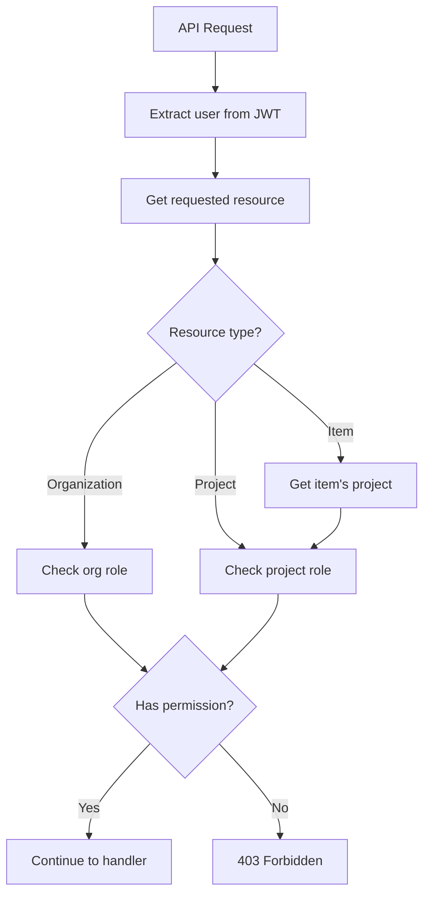

# Permission Check Flows

*Parent: [PROCESS_FLOWS.md](../PROCESS_FLOWS.md)*

RBAC permission checking for API endpoints.

**Key Concepts**:
- Two-level roles: organization and project
- Permission check based on resource type
- Org admins have implicit project access
- Items inherit project permissions

---

## API Endpoint Check Flow



---

## Permission Matrix

| Action | Admin | Project Manager | Team Member | Viewer |
|--------|-------|-----------------|-------------|--------|
| View project | Yes | Yes | Yes | Yes |
| Create item | Yes | Yes | Yes | No |
| Edit item | Yes | Yes | Assigned only | No |
| Delete item | Yes | Yes | No | No |
| Edit project settings | Yes | Yes | No | No |
| Manage team | Yes | No | No | No |
| View budget | Yes | Yes | Yes | Yes |
| Edit budget | Yes | Yes | No | No |
| AI chat | Yes | Yes | Yes | Yes |
| Export data | Yes | Yes | Yes | Yes |

---

## Role Hierarchy

```
Organization Level:
  owner → admin → member

Project Level:
  admin → project_manager → team_member → viewer
```

**Inheritance**:
- Org owners/admins automatically get project admin on all projects
- Org members need explicit project role assignment

---

## Permission Check Implementation

```python
from enum import Enum
from typing import Optional
from uuid import UUID

class Permission(Enum):
    VIEW = "view"
    CREATE = "create"
    EDIT = "edit"
    DELETE = "delete"
    MANAGE_TEAM = "manage_team"
    EDIT_BUDGET = "edit_budget"

PROJECT_ROLE_PERMISSIONS = {
    "admin": {Permission.VIEW, Permission.CREATE, Permission.EDIT,
              Permission.DELETE, Permission.MANAGE_TEAM, Permission.EDIT_BUDGET},
    "project_manager": {Permission.VIEW, Permission.CREATE, Permission.EDIT,
                        Permission.DELETE, Permission.EDIT_BUDGET},
    "team_member": {Permission.VIEW, Permission.CREATE, Permission.EDIT},
    "viewer": {Permission.VIEW},
}


async def check_project_permission(
    user_id: UUID,
    project_id: UUID,
    permission: Permission
) -> bool:
    """Check if user has permission on project."""
    # Check org role first (admins have full access)
    org_role = await get_user_org_role(user_id, project_id)
    if org_role in ("owner", "admin"):
        return True

    # Check project-specific role
    project_role = await get_user_project_role(user_id, project_id)
    if not project_role:
        return False

    return permission in PROJECT_ROLE_PERMISSIONS.get(project_role, set())
```

---

## FastAPI Dependency

```python
from fastapi import Depends, HTTPException, status

def require_permission(permission: Permission):
    """Dependency factory for permission checking."""
    async def dependency(
        project_id: UUID,
        current_user: User = Depends(get_current_user)
    ):
        has_permission = await check_project_permission(
            current_user.id,
            project_id,
            permission
        )
        if not has_permission:
            raise HTTPException(
                status_code=status.HTTP_403_FORBIDDEN,
                detail="Insufficient permissions"
            )
        return current_user
    return dependency


# Usage in routes
@router.delete("/projects/{project_id}/items/{item_num}")
async def delete_item(
    project_id: UUID,
    item_num: int,
    current_user: User = Depends(require_permission(Permission.DELETE))
):
    """Delete item - requires DELETE permission."""
    ...


@router.get("/projects/{project_id}/items")
async def list_items(
    project_id: UUID,
    current_user: User = Depends(require_permission(Permission.VIEW))
):
    """List items - requires VIEW permission."""
    ...
```

---

## Team Member Edit Restriction

Team members can only edit items assigned to them:

```python
async def check_item_edit_permission(
    user_id: UUID,
    project_id: UUID,
    item: Item
) -> bool:
    """Check if user can edit specific item."""
    # Admins and PMs can edit any item
    role = await get_user_project_role(user_id, project_id)
    if role in ("admin", "project_manager"):
        return True

    # Team members can only edit assigned items
    if role == "team_member":
        user = await get_user(user_id)
        return item.assigned_to == user.name

    return False
```
