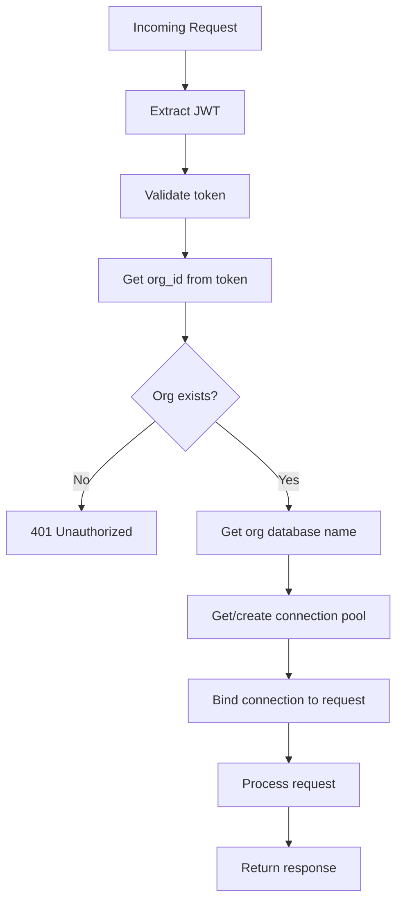

# Multi-Tenancy Flows

*Parent: [PROCESS_FLOWS.md](../PROCESS_FLOWS.md)*

Database-per-organization request routing.

**Key Concepts**:
- Org context extracted from JWT
- Database connection routed per request
- Connection pools cached per org
- Complete data isolation

---

## Request Routing Flow



---

## Organization Database Selection

```python
from uuid import UUID
import asyncpg
from typing import Dict

# Connection pool cache
connection_pools: Dict[UUID, asyncpg.Pool] = {}

async def get_org_connection(org_id: UUID) -> asyncpg.Pool:
    """Get database connection for organization."""
    # Check cache
    if org_id in connection_pools:
        return connection_pools[org_id]

    # Get org from central DB
    org = await central_db.get_organization(org_id)
    if not org:
        raise NotFoundError("Organization", str(org_id))

    # Create pool for org database
    pool = await asyncpg.create_pool(
        database=org.database_name,
        host=config.database.host,
        port=config.database.port,
        user=config.database.user,
        password=config.database.password,
        min_size=2,
        max_size=10,
    )

    connection_pools[org_id] = pool
    return pool
```

---

## Middleware Integration

```python
from fastapi import Request, Depends
from starlette.middleware.base import BaseHTTPMiddleware

class OrgConnectionMiddleware(BaseHTTPMiddleware):
    async def dispatch(self, request: Request, call_next):
        # Skip for auth endpoints
        if request.url.path.startswith("/auth"):
            return await call_next(request)

        # Get org from validated token
        user = getattr(request.state, "user", None)
        if not user or not user.org_id:
            return JSONResponse(
                status_code=401,
                content={"error": "AUTHENTICATION_ERROR"}
            )

        # Bind org connection to request
        pool = await get_org_connection(user.org_id)
        request.state.org_pool = pool

        response = await call_next(request)
        return response


def get_org_pool(request: Request) -> asyncpg.Pool:
    """Dependency to get org database pool."""
    return request.state.org_pool
```

---

## Route Usage

```python
from fastapi import APIRouter, Depends
import asyncpg

router = APIRouter()

@router.get("/projects")
async def list_projects(
    pool: asyncpg.Pool = Depends(get_org_pool),
    current_user: User = Depends(get_current_user)
):
    """List projects - automatically uses org's database."""
    projects = await services.aurora.execute_query(
        pool,
        """
        SELECT * FROM projects
        WHERE deleted_at IS NULL
        ORDER BY name
        """
    )
    return {"data": [ProjectResponse.from_row(p) for p in projects]}
```

---

## Database Naming

| Database | Purpose |
|----------|---------|
| braidmgr_central | Users, organizations, memberships |
| braidmgr_org_{slug} | Per-org data (projects, items, etc.) |

**Example**:
- org slug: "acme-corp"
- database name: "braidmgr_org_acme_corp"
